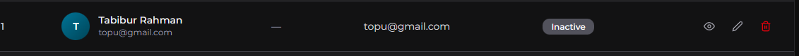
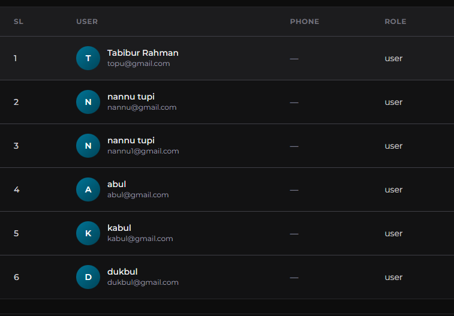

## Future Task
1. dashboard category list page e, active and inactive koto gula, category ase, seigula table er header e show korano gele valo hoto. and bulk delete option thakleu valo hoto.  ex:  and, 
2. deleted item should be go under the trash item for 30 days.
3. tag jdi admin create kore, tahole status by default active hobe, otherwise sobar jonnei pending hobe. (backend tag modules, create tag controller and service)
4. tag list page e, active and inactive koto gula, tag ase, seigula table er header e show korano gele valo hoto. and bulk delete option thakleu valo hoto. same as like option 1.
5. sidebar eer bottom e logout button thakbe.
6. user details show korano lagbe. table theke, like the image .
7. user manage table ee user role gula different color e , different role show korano lagbe pore. 

## Task
1. https://dreamspos.dreamstechnologies.com/html/template/permissions.html   ==> ei link er permission system ta amdr user management er moddhe kora lagbe...
2. 